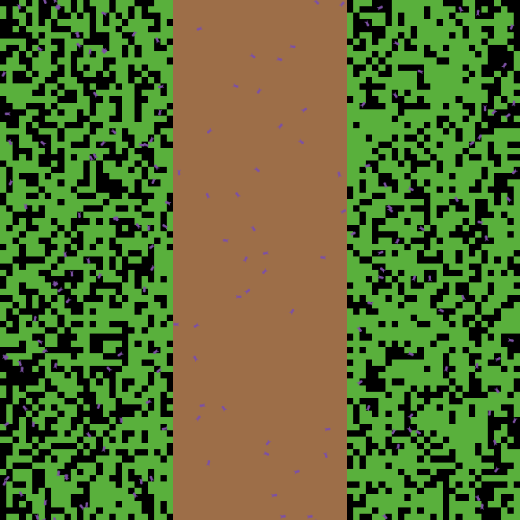

# About

サバクトビバッタのシミュレーションを行うNetLogoのプログラムです。
サバクトビバッタは、群れで行動し周囲にいる他の個体を恐れて飛行することを繰り返し、世界中へと拡散し、2020年現在、多くの農作物を食い荒らしています。

locust_desert.nlogoプログラムは、これらの周囲にいるとより遠くに飛ぶという性質をモデリングしたものです。また、アヒル軍を追加することができ、中国のアヒル軍の効果を検証することができます。

また、locust_sea.nlogoは、中国などの日本の隣接している国から日本へサバクトビバッタが飛行してくるかのシミュレーションを行うことができます。

    

---

## WHAT IS IT?

サバクトビバッタは、局所的に密集すると群生相と呼ばれる形質に変化する。このとき、サバクトビバッタの群れは遠くまで移動するようになり、広範囲の作物が食い荒らされてしまう。

このプログラムは、これらのサバクトビバッタの動きをシミュレーションする。

When desert locusts are locally densely packed, they change into a trait called phase gregaria. At this time, the swarms of the desert locusts move far away, and a wide range of crops are eaten away.

The program simulates the movement of these desert locusts.

## HOW IT WORKS

サバクトビバッタのエージェントは、周囲にいる他の個体の数に比例して、より遠くに飛ぶようになる。
パラメータを設定することで、砂漠を乗り越えて、右側の草原に到達するサバクトビバッタの群れの創発をみることができる。

また、アヒル (birds)によって、サバクトビバッタの数を減らし、右側の草地に到達する可能性を減らすことができる。

The agent of the desert locust flies farther in proportion to the number of other individuals around it.
By setting parameters, it is possible to see the emergence of a swarm of desert locusts that cross the desert and reach the grassland on the right.

Ducks (birds) can also reduce the number of desert locusts and the likelihood of reaching the grassland on the right.

## HOW TO USE IT

- num-of-locustsは、バッタの数を表すパラメータである。数が少ないと孤独相のため、移動せずそのまま死に絶える。
- num-of-birdsは、アヒルの数を表すパラメータである。
- desert-leftとdesert-rightは中央の砂漠のx座標の範囲を表す。regrow-rateは草の再生率であり、値が大きいほどより高い確率で草が再生する。
- gain-life-from-grassは、サバクトビバッタが草を食べることで得られる体力である。この値が大きいほどサバクトビバッタは体力が増加し、多くの子供を生む。
- use-life-to-birth-locustはサバクトビバッタが子供を生むために必要な体力を表す。
- can-see-of-locustsは、あるサバクトビバッタが周囲何マスのサバクトビバッタを見ることができるかを表す。この値が大きいほど、サバクトビバッタは孤独相から群生相に変化し遠くまで移動してしまう。
- move_per_seeは、can-see-of-locustsで定まる個体数を割る単位である。つまり、周囲にいるバッタがmove_per_seeいるごとに１だけさらに移動する。そのため、move_per_seeが小さいほどサバクトビバッタは遠くまで移動するようになる。eat-locusts-rateは、アヒルがどれくらいの割合で周囲のサバクトビバッタを食べるかを表す。
- show-power?はサバクトビバッタの今の移動距離を表すかのスイッチでありオンにすると移動距離が示される。

----

- num-of-locusts is a parameter representing the number of locusts. If the number is small, they die without moving.
- num-of-birds is a parameter that represents the number of ducks.
- desert-left and desert-right represent the x-coordinate range of the central desert. The regrow-rate is the regrowth rate of grass, and the higher the regrowth rate, the higher the rate.
- gain-life-from-grass is the physical strength that a desert locust gains by eating grass. The higher this value is, the stronger the body strength of the desert locust and the more children it produces.
- use-life-to-birth locust indicates the physical strength required for a desert locust to bear a child.
- Can-see-of-locusts indicates how many swarms a swarf grasshopper can see around it. The higher the value, the more the desert locust changes from a solitary phase to a colonial phase and migrates far away.
- move_per_see is the number of individuals divided by can-see-of-locusts. That is, one more movement occurs for each move_per_see in the surrounding locusts. Therefore, the smaller the move_per_see is, the farther the grasshopper migrates. The eat-locusts-rate represents the rate at which the duck eats the surrounding desert locusts.
- show-power? is a switch indicating the current travel distance of the desert locust, and when turned on, the travel distance is indicated.

## EXTENDING THE MODEL

- 気温や天候などの外的要因の追加
- 世代変化の追加

---

- Addition of external factors such as temperature and weather
- Addition of generation Change

## CREDITS AND REFERENCES

- Ariel, Gil, and Amir Ayali. "Locust collective motion and its modeling." PLoS Computational Biology 11.12 (2015): e1004522.
- Zhang, Long, et al. "Locust and grasshopper management." Annual review of entomology 64 (2019): 15-34.

